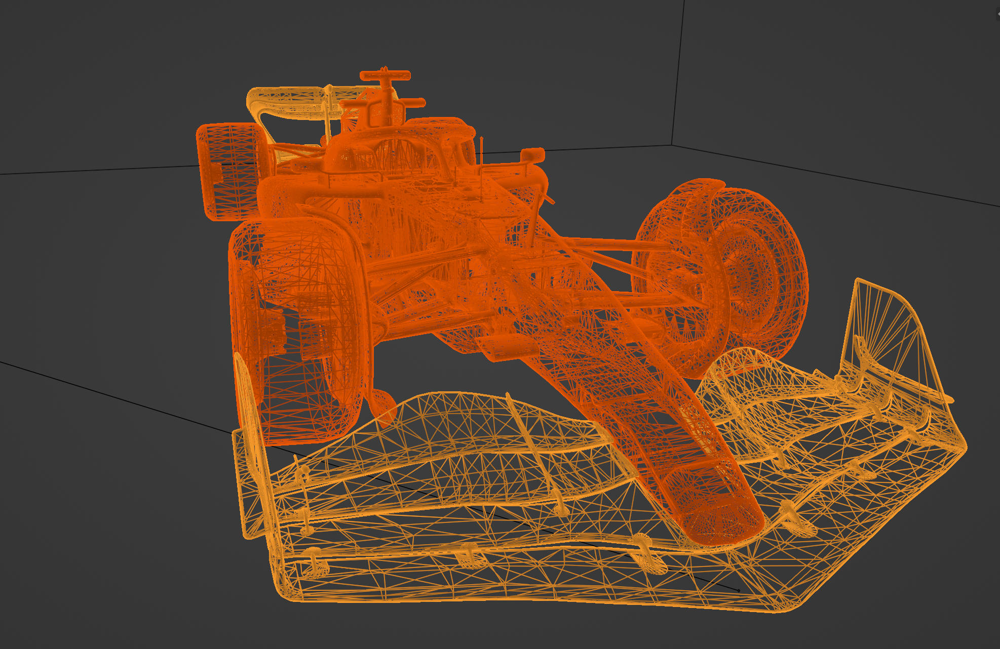
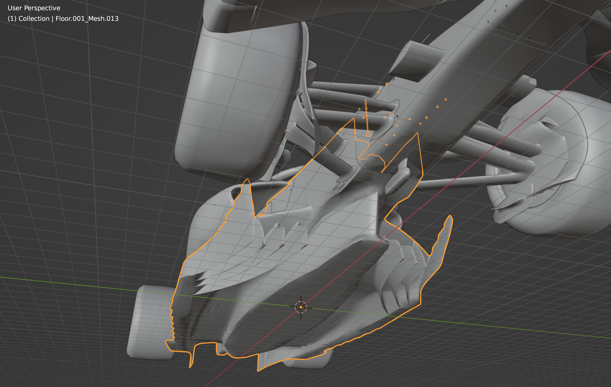

# Alfa Romeo C42 3d-Model Files
This repository provides 3d models based on the AR model presented by Alfa Romeo themselves.

 

C42 Model
=======

### Obj - Files
- Entire Car: c42.obj
- Parts: models/*.obj

### Glb - Files
- Entire Car: c42.glb

 

Blender Demo File
=======
There is a Blender demo file with textures and a Mantaflow Simulation. The project was created with Blender 3.2 alpha but should work with every Blender version above 2.9.

File: 
- c42 gas.blend

**_NOTE:_** Feel free to open an "Issue" or contact me directly if something does not work or you want to contribute something to this project.

 

Links
=======
- [Official Alfa Romeo C42 Website](https://www.sauber-group.com/motorsport/formula-1/c42/)

- [Information about the C42 on Wikipedia](https://en.wikipedia.org/wiki/Alfa_Romeo_C42)

- [C42 AR Presentation by Alfa Romeo](https://viewer.jig.space/?p=0003&jig=1OeRwjw7&shad=1)

 

License
======
- [WTFPL](LICENSE.md)
